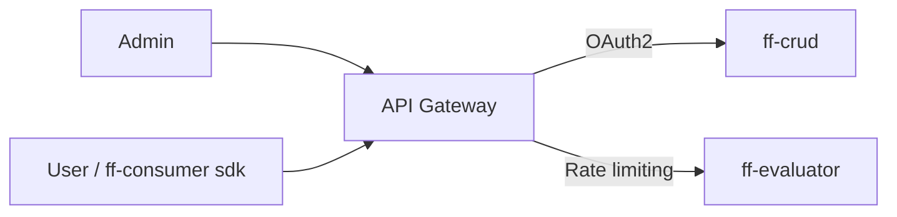

# ADR: API Gateway без BFF

## Status

Proposed.

## Context

У системы два типа клиентов с разными сценариями:

- **администратор**: через веб-приложение просматривает и изменяет флаги;
- **приложения**: через `ff-consumer sdk` запрашивают роллаут флагов пользователя.

Для этих сценариев нужны разные политики доступа: админский api должен быть закрыт oauth2, а высоконагруженный пользовательский api — защищён рейт-лимитером.

Отдельный bff для админки не требуется: `ff-crud` уже предоставляет весь необходимый api, и нет необходимости агрегировать данные нескольких сервисов.

## Decision

Использовать api gateway как единую внешнюю точку входа без отдельного bff.

Gateway разделяет два потока трафика:

- запросы админки проверяются через oauth2 и проксируются в `ff-crud`;
- запросы `ff-consumer sdk` проходят через rate limiter и проксируются в `ff-evaluator`.

Gateway не содержит бизнес-логики и не преобразует контракты сервисов.

Детали аутентификации и модели доступа описаны в [отдельном документе](../design/authentication-authorization.md).

## Consequences

Положительные последствия:

- разные политики доступа для админского и пользовательского api;
- нет лишнего bff, а значит нет расходов на его поддержку и эксплуатацию;
- короткие цепочки запросов: `gateway → ff-crud` и `gateway → ff-evaluator`;
- внутренние сервисы не публикуются наружу.

Отрицательные последствия и риски:

- api gateway становится критическим компонентом, поэтому требует повышения отказоустойчивости;
- контракт админской spa напрямую связан с api `ff-crud`;
- некорректная настройка маршрутизации или рейт-лимитера может повлиять сразу на оба потока трафика.
