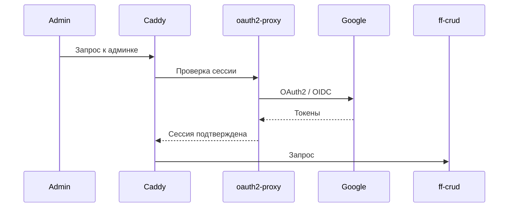

# Аутентификация и авторизация

## Роли

- **Администратор** управляет флагами через UI и `ff-crud`.
- **Приложение** вычисляет значения флагов через `ff-evaluator`.

## Вход администратора

Google выдаёт токены и подтверждает личность. `oauth2-proxy` проверяет токены и сессию, а Caddy защищает административные маршруты через `forward_auth`. `ff-crud` токены не проверяет.

## Модель доступа

Используется проверка доступа на gateway по OAuth-сессии и списку разрешённых email. RBAC отсутствует. `/evaluate` доступен без OAuth.

Такое разделение выбрано из-за разных политик: административный api требует аутентификации, а высоконагруженный api вычисления флагов — rate limiting.

## Принадлежность объектов

Ownership не реализован: у флага нет владельца, и любой допущенный администратор может изменять любой флаг. Для `GET`, `PATCH` и `DELETE` проверяется только существование флага в бд.
