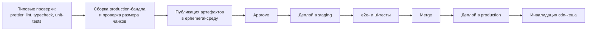

# Frontend Deployment

## Pipeline

## Environments

- **dev** — локальная разработка с dev-сборкой;
- **ephemeral** — отдельная сборка для каждого pull request, удаляемая после его закрытия;
- **staging** — production-подобная среда для e2e- и ui-тестов;
- **production** — рабочая админка.

## Runtime and CDN

Ssr не нужен. Приложение использует csr и после сборки представляет собой статические html, js и css-файлы. Они размещаются в object storage и раздаются через cdn. Js/css-файлы кешируются надолго, а `index.html` на короткое время, чтобы пользователи быстро получали новую версию.

## Scaling

Frontend не требует вертикального масштабирования и собственных runtime-инстансов: раздача статики горизонтально масштабируется средствами cdn. Рост числа потребителей админки увеличивает нагрузку на api `ff-crud`, но несущественно, одного инстанса будет вполне достаточно (возможно, двух для обеспечения отказоустойчивости).
