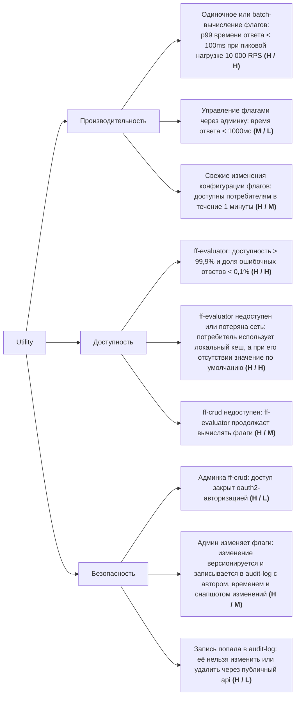

# Utility Tree

```mermaid
flowchart LR
    U["Utility"]

    U --> P["Производительность"]
    U --> A["Доступность"]
    U --> S["Безопасность"]

    P --> P1["Одиночное или batch-вычисление флагов:<br/>p99 времени ответа < 100ms при пиковой нагрузке 10 000 RPS <b>(H / H)</b>"]
    P --> P2["Управление флагами через админку: время ответа < 1000мс <b>(M / L)</b>"]
    P --> P3["Свежие изменения конфигурации флагов: доступны потребителям в течение 1 минуты <b>(H / M)</b>"]

    A --> A1["ff-evaluator: доступность > 99,9% и доля ошибочных ответов < 0,1% <b>(H / H)</b>"]
    A --> A2["ff-evaluator недоступен или потеряна сеть: потребитель использует локальный кеш, а при его отсутствии значение по умолчанию <b>(H / H)</b>"]
    A --> A3["ff-crud недоступен: ff-evaluator продолжает вычислять флаги <b>(H / M)</b>"]

    S --> S1["Админка ff-crud: доступ закрыт oauth2-авторизацией <b>(H / L)</b>"]
    S --> S2["Админ изменяет флаги: изменение версионируется и записывается в audit-log с автором, временем и снапшотом изменений <b>(H / M)</b>"]
    S --> S3["Запись попала в audit-log: её нельзя изменить или удалить через публичный api <b>(H / L)</b>"]
```
